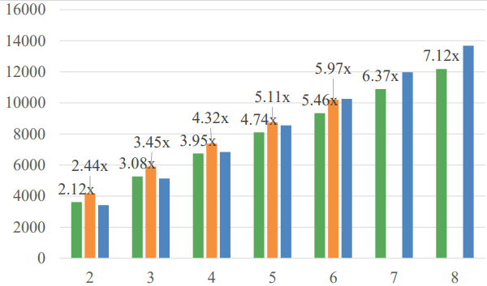
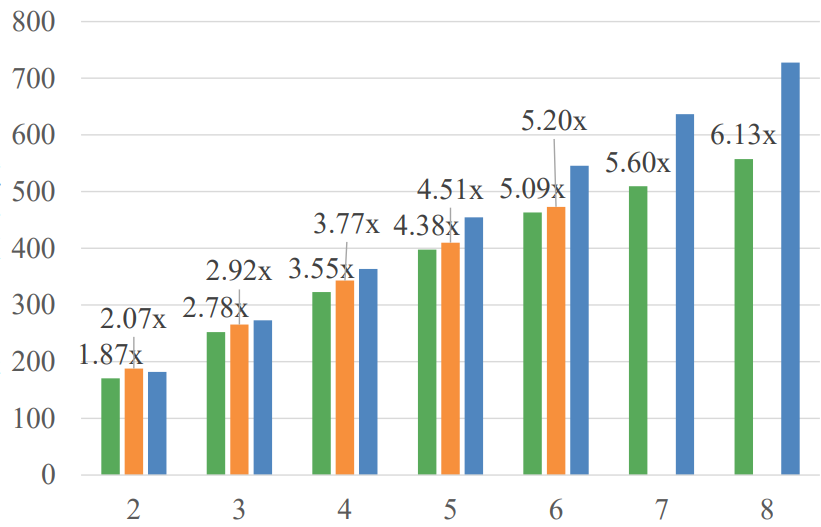
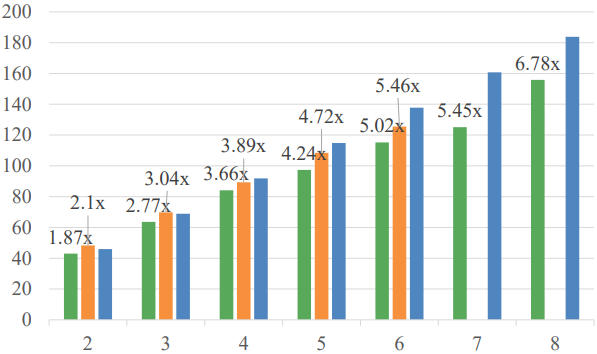
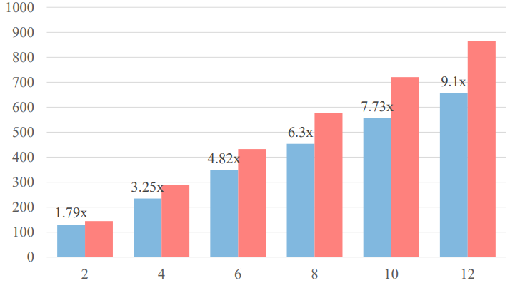
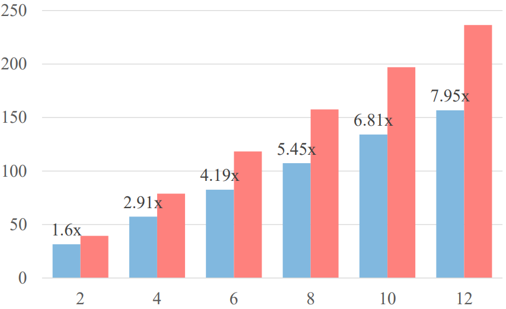
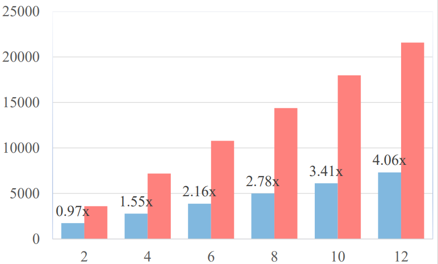

## TestBed

| Name | GPU     | Bandwidth |
|------|---------|-----------|
| lm1  | 2080 Ti | 1 Gbps    |
| lm6  | 2080 Ti | 1 Gbps    |
| room | V100    | 100 Gbps  |
| AWS  | V100    | 100 Gbps  |

|         | CUDA | cuDNN | jaxlib | cupy  |
|---------|------|-------|--------|-------|
| Version | 10.1 | 7.6.5 | 0.1.56 | 8.3.0 |

- ResNet18 batch size (per replica): 128
- ResNet101 batch size (per replica): 128
- Bert-base batch size (per relica): 8, sentence length 128.

## Baseline

|      | ResNet18 (images/s) | ResNet101 (images/s) | Bert-base (words/s) |
|------|---------------------|----------------------|---------------------|
| lm1  | 74.31               | 19.70                | 1798.73             |
| lm6  | 72.07               | 21.06                | 1906.47             |
| room | 90.94               | 22.97                | 1710.08             |
| AWS  | 90.20               | 23.94                | 2269.57             |

## Results

### Setting: 1x node, up to 8x GPUs, on lm1 and lm6

- Green: AllReduce
- Orange: PS
- Blue: Ideal

#### Bert-base

#### ResNet-18

#### ResNet-101

### Setting: up to 3x nodes, up to 12x GPUs

- Blue: AllReduce
- Red: ideal

Note: we observe bandwidth bottleneck.

#### 1 Gbps bandwidth, ResNet-18

#### 1 Gbps bandwidth, ResNet-101

#### 1 Gbps bandwidth, Bert-base

#### 100 Gbps bandwidth
|           | Throughput (12 nodes) | Scalability (x) | Throughput (16 nodes) | Scalability (x) |
|-----------|-----------------------|-----------------|-----------------------|-----------------|
| ResNet18  | 915.43                | 10.15x          | 1191.73               | 13.21x          |
| ResNet101 | 248.76                | 10.43x          | 326.49                | 13.69x          |
| Bert-base | 20479.66              | 9.08x           | 26798.02              | 11.88x          |
